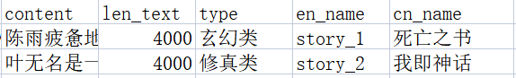

<center><h1>Text_To_Video </h1></center>

<h2>介绍</h2>

Text_To_Video 是一个利用本文直接生成视频的项目，可以帮助广大自媒体应用者快速批量生产视频，用户可以在本地进行部署。该项目主要是集成了chatglm-6b、stable diffusion、免费的tts服务，最终利用moviepy合成视频。


Text_To_Video 项目旨在与开源社区一起推动智能项目的工程落地与发展，恳请开发者和大家遵守开源协议，勿将项目代码及基于项目产生的衍生物用于任何可能给国家和社会带来危害的用途以及用于任何未经过安全评估和备案的服务。
该项目后续会出网页版本、windows应用以及os应用和安卓应用

<h2>使用方式</h2>

<h3>硬件要求</h3>
想要批量生成，建议显卡16g+比较合适


<h3>环境准备</h3>
1、 chatglm的安装，直接访问 [chatglm](https://github.com/THUDM/ChatGLM-6B)   。安装即可。

2、stable diffusion准备，下载可能比较慢，直接上传百度网盘了。  

    链接：https://pan.baidu.com/s/1OEi3nVLS-COZP5Qkmj6b-w   
    提取码：204f   

3、 chatglm、stable diffusion都要启动api服务

4、 在data_tts.py中替换你自己的api-key

<h3>数据准备</h3>
具体的数据可以是爬取的小说内容，也可以是利用chatglm或者chatgpt直接生成的内容，但是文本格式要满足一下要求。

  
  
格式说明：  
+ content是具体的文本信息
+ 每一行生成一个视频
+ 如果你批量为小说生成视频，type可以是名称，en_name不能重复，直接story+（递增数字）就可以


<h3>程序运行</h3>

直接运行main.py中的main方法即可

```python

if __name__ == '__main__':
    # 定义源文件的路径
    # 这里是你自己的源文件路径，一般需要放在data/source_data目录下
    vedio_path = batch_merge('data/source_data/example1.csv')
```


<h2>代码阅读</h2>

代码执行逻辑流程如下：
+ 0、准备语料。
+ 1、切割源文件，句号分割语料，形成新的文件。
+ 2、利用chatglm生成提示词，prompt negative。
+ 3、利用第1步的语料，调用tts的api生成语音。
+ 4、利用第2步生成提示词，调用stable diffusion的api生成图片。
+ 5、将第3步的语音和第4步的图片合成视频。

分别对应：
```python
data_prepare.py
data_split.py
data_promt_words.py
data_tts.py
data_to_image.py
data_to_vedio.py
```

<h2>协议</h2>

本仓库的代码依照 Apache-2.0 协议开源。
<h2>严禁</h2>

未经许可，严禁商用。


<h2>欢迎关注公众号与知识星球</h2>QQ群：1083992954


